Batch normalization  - нормализует батч по столбцам

Layer normalization - приводим среднее и дисперсию к $\beta$ и $\gamma$ по строкам

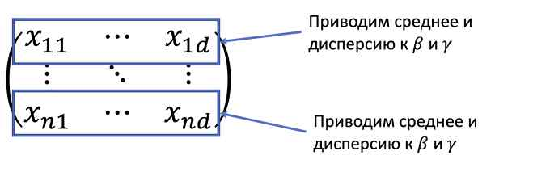

То же самое было в bag of words (доля слов в тексте)

Особенно layernorm встречается в последовательностях

# Инициализации

- Не должно быть симметрией (плохо инициализировать всё одним числом)
- Хороший вариант:
	Хе-инициализаця
	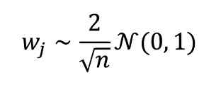
	n - число входом
- Пытаемся сделать так, чтобы масштаб всех входов был примерно одинаковым
Если неправильно проинициализировать, то есть шанс того, что числа будут расти быстрее, чем обычно

# Аугментация

Идея: Если мы работаем с картинками, то в случае с картинками есть понятные модификации, но не меняющие суть

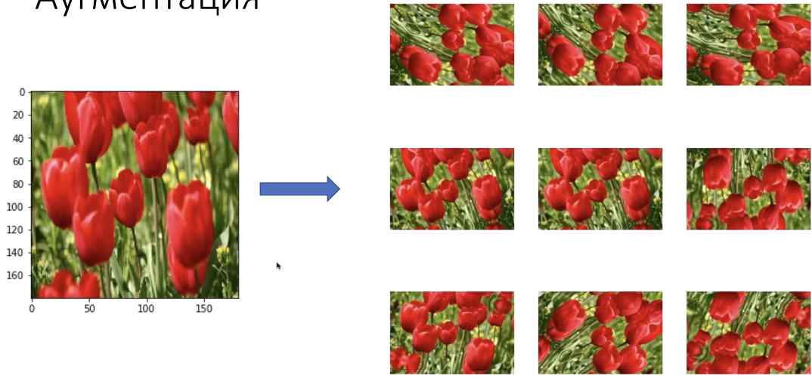

Так мы можем размножить ресурс для обучения

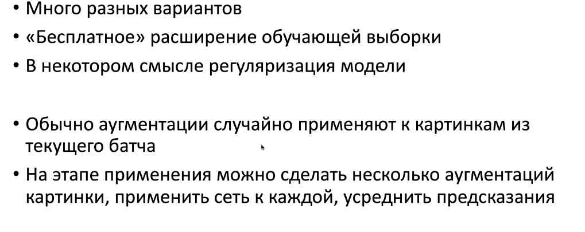

- Много разных вариантов
- Бесплатное расширение 

# Архитектуры свёрточных сетей

### LeNet (1998)

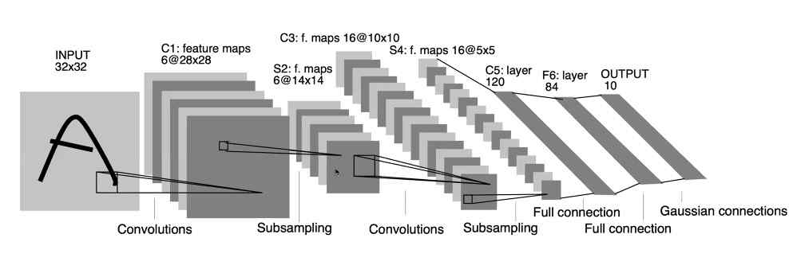

6 каналов = 6 фильтров, сворачивание с 6 фильтрами

subsampling = max pooling

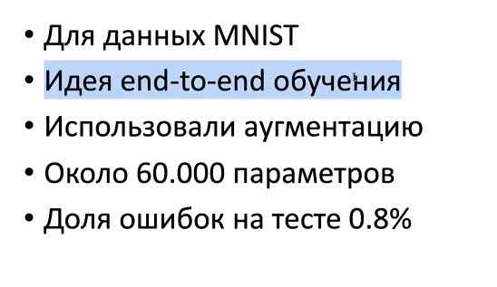

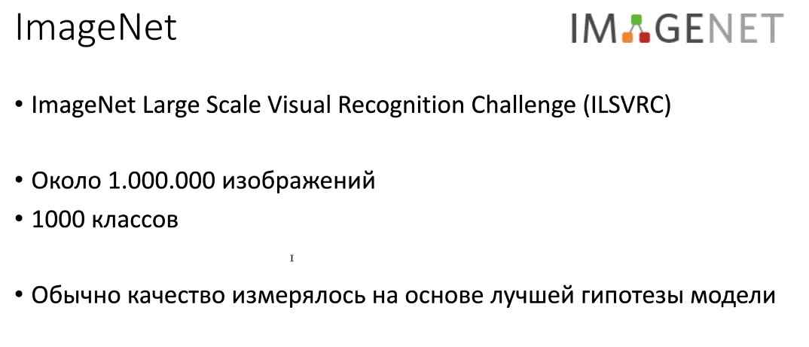

в 2010 году сделали 1к классов и огромный датасет с картинками - Image Net

### AlexNet (2012)

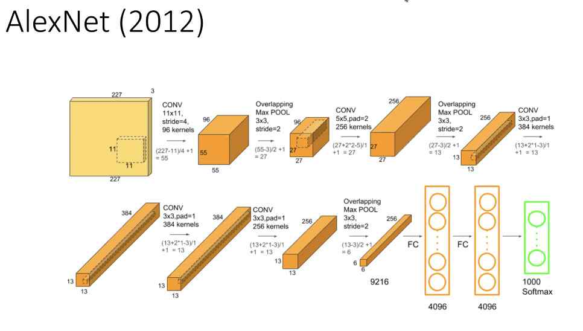

в целом тут то же самое (чередование сверток и макспулингов)

но есть особенности:
1. Большой фильтр в первом шаге
2. Снова свертка, но фильтр 5х5
3. Softmax

FC = fully connected слой

softmax:
он берет z1, exp(z1) и делит на сумму экспонент всех векторов
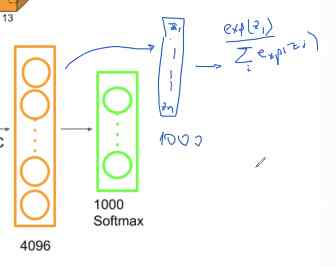

на выходе будет вектор той же длинны, похожий на вектор вероятностей

выходов столько же, сколько классов

гиперпараметр: число слоёв, коэф регуляризации, stride, ...

AlexNet:
- использует ReLU, аугментацию, dropout
- Град спуск с инерцией
- Обучение на двух GPU (5-6 суток)
- Около 60 миллионов параметров
- Ошибка около 17% (top 5 error)

top 5 accuracy: сортируем вероятности классов по убыванию
кот 15%
собака 10%
... 5%
... 5%
... 1%

если в top 5 есть правильный класс, то ответ считается правильным

это делается, потому что разметка была неидеальная, было много классов и не всегда указаны все в разметке. Кот может быть маленьким, но есть, а разметка его не заметила

### VGG (2014)

для vgg предложили 5 вариантов разных по кол-ву параметров. Самый "жирный" - E

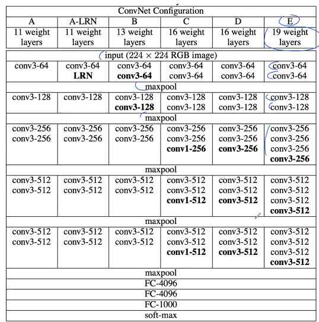

- свёрточные слои с фильтрами 3х3
- в конце тоже 2fc + 1fc->1000 и softmax

Кол-во параметров увеличилось в 2 раза

в alexNet есть недостаток. Есть часть сверток и макспулингов, а есть часть fc. В первой части очень много вычислений производится, но параметров мало. Идея VGG - увеличить долю параметров в свёрточной части. Да, фильтры чуть поменьше, но их много. Теперь свёрточная часть получила больше параметров, стала более обучаемая

VGG
- Только маленькие свёртки
	- Меньше параметров
	- больше нелинейности (много фильтров)
	- больше параметров в свёрточных слоях
- Град спуск с инерцией
- Dropout для двух первых полносвязных слоёв
- Хитрая инициализация (сначала обучается вариант А со случайными начальными весами, потом им инициализируются более глубокие сети). Таким образом идя от архитектуры A до E мы разбиваем обучение на несколько частей и так быстрее обучается сеть

### GoogLeNet (2014) (Inception)

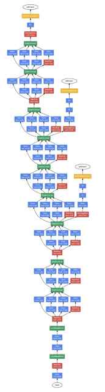
Довольно глубокая архитектура...

У архитектуры есть 3 выхода. Главный и 2 других. Теперь у нас 3 функции потерь

Тут довольно хитрые слои

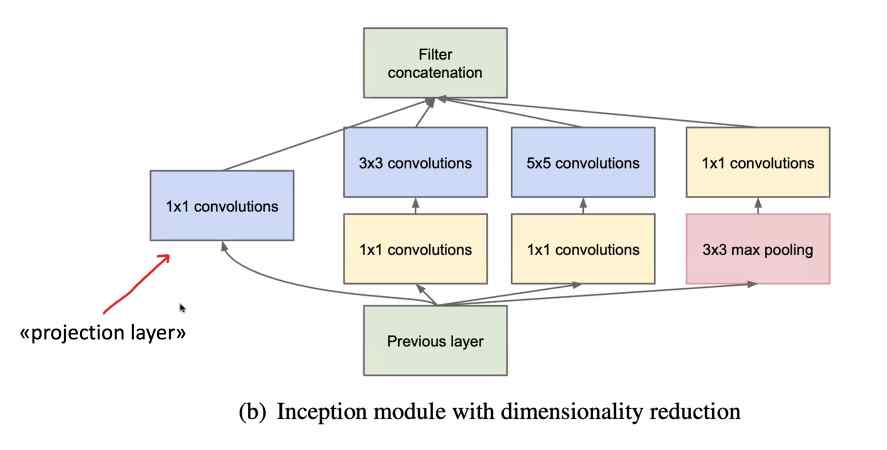

Со слоем делаются 4 параллельные операции (свертки делаются с паддингом)
1. Свёртка 1х1 (линейное преобразование по каналам, объединяем каналы?, метод главных компонент)
2. свертка 3х3
3. свертка 5х5
4. свертка 3х3 с макспулингом

top5error - 6.67%

### ResNet(2015)

придумали эвристику "остаточные связи"

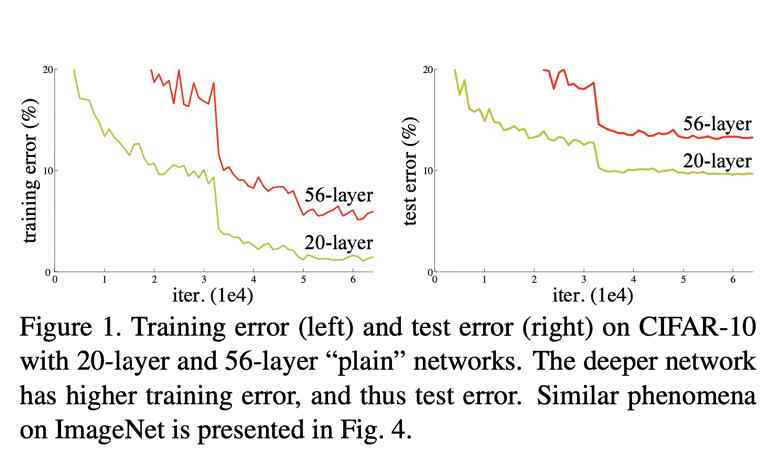

Наблюдение: давайте возьмем 2 архитектуры. Допустим, нам хватает мощностей

20-слойная архитектура обучается, 56 тоже, но 56 даже хуже на train. Похоже, мы как-то не так обучаем модель и даже когда даем переобучиться, она все равно не хочет

Наверное, проблема в том, что сеть глубокая и градиенты не доходят до последних слоёв
- Добавление слоёв в свёрточную сеть ухудшает качество даже на обучении
- Хотя, возможностей ...

Здесь вступают в ход остаточные связи

Давайте прибавлять к выходу то, что пришло на вход предыдущему слою

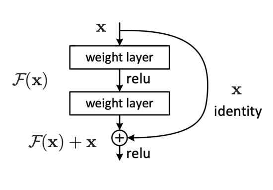

архитектура ResNet

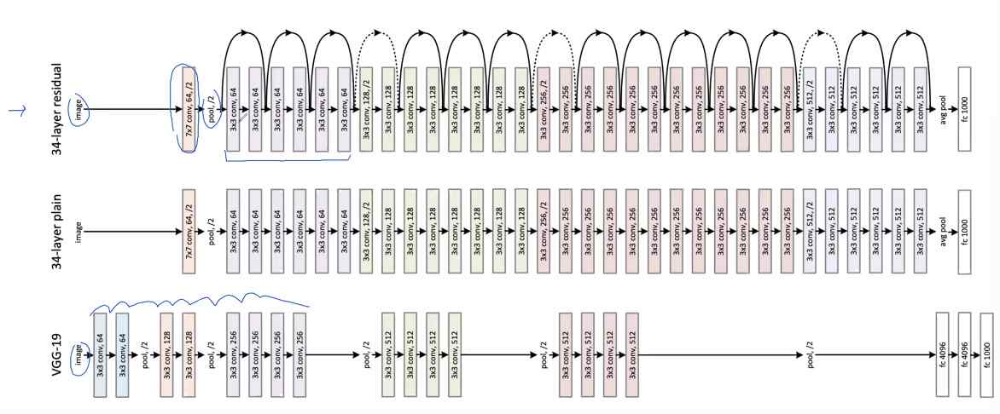

Здесь вместо макспулинга мы делаем свертку со страйдом 2. Это замена макспулингу

Проблемы возникают, когда мы "прокидывание" делаем через страйд

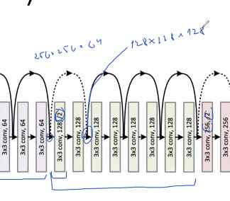

Давайте просто добьем нулями. По пространству сжимаем, а по каналом добиваем нулями

А что внутри? **ResNet block**:

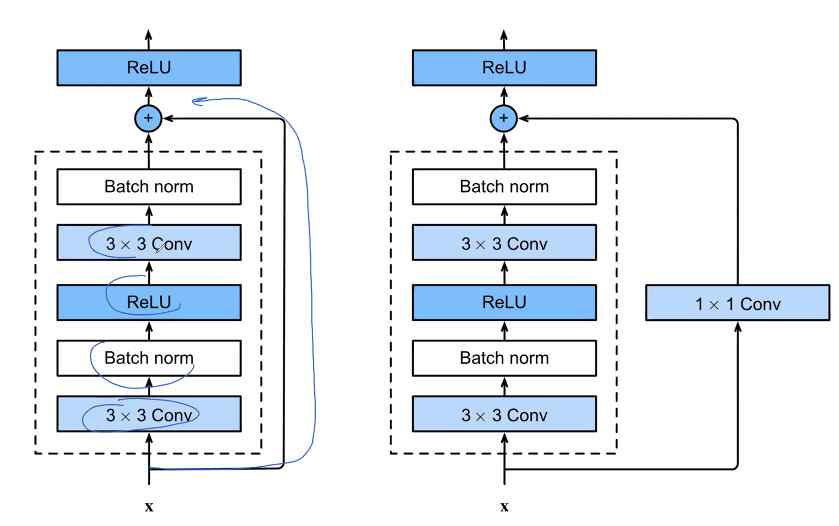

Global average pooling - это операция, где схлопываются каналы

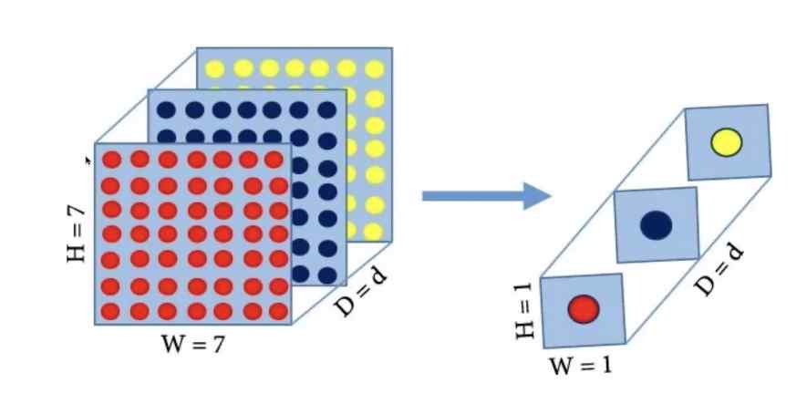

Это сделано, чтобы архитектура могла применять на вход картинку любого размера
