# Работа с текстами

### Векторные представления слов

(эмбеддинг)

Bag of words
- Заводим словарь, состоящий из всех слов в выборке
- Делаем признак-индикатор для каждого слова из словаря
- Можно добавлять n-граммы

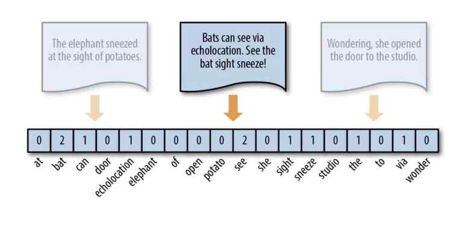

минусы:
- слишком много признаков
- не учитываем смыслы слов
- семантически похожие тексты могут иметь очень разное представление

### word2vec

Попробуем обучить вектор-представление для каждого слова

Но что потребовать от такого представления?

- Важная идея: если выкинуть слово, то оно должно хорошо восстанавливаться по представлениях соседних слоёв
- Может применять и при работе с изображениями

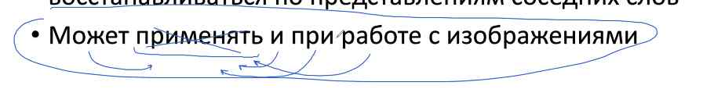

Поэтому синонимы будут примерно одинаковые

Также хочется, чтобы слова с опечатками имели тот же вес, что и без 

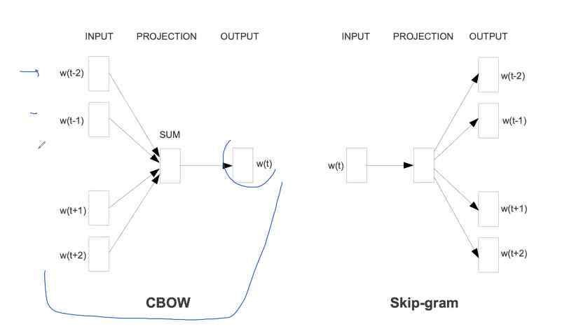

CBOW - continious bag of words

Skip-gramm - наоборот

Skip-gram model

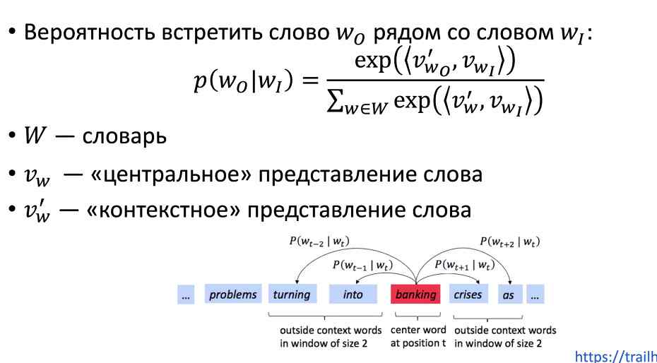

для каждого слова мы будем использовать 2 представления

Давайте мы зададим вероятность встретить слово w0 в контексте w1. Мы размер контекста задаём гиперпараметром

W - весь контекст

экспонента нужна, чтобы все это было неотрицательное

что в этой модели является параметрами? - Vw0 и Vw1

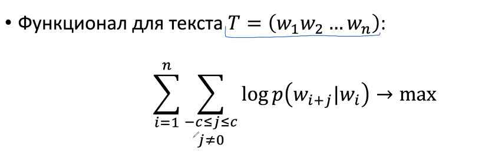

максимизируем вероятности

скалярное произведение - формула "похожести" векторов, сонаправленности векторов

НО! Есть проблема с формулой обучения

- считать знаменатель для обучения ОЧЕНЬ затратно
- Значит, производные считать тоже долго

W имеет большой размер (уникальные слова в тексте)

Как упростить?

### Negative sampling

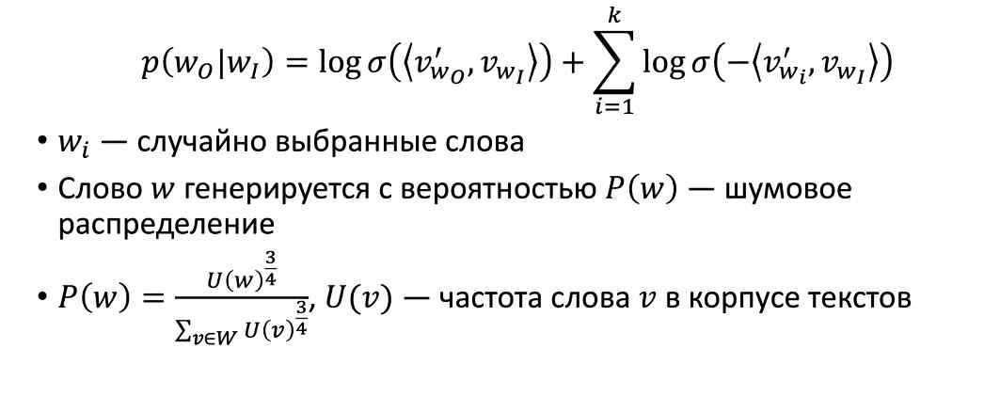

у нас в знаменателе большая сумма, давайте оставим только пару слагаемых

тогда делаем уже не софтмакс, а сигмоиду

А для знаменателя сделаем сумму логарифмов сигмоид

Тут суммирование по k словам, а не по всему словарю, что сильно ускоряет процесс

Но как выбирать эти слова? У нас разное распределение и мы должны брать не "предлоги" и не остальные частые слова в контексте

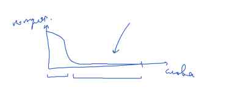

Как это использовать?

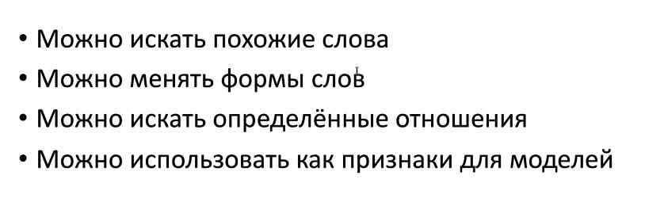

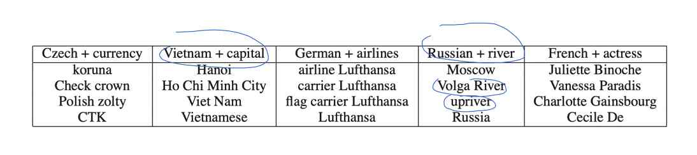

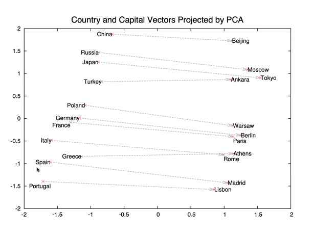

- Яркий пример self-supervision
- Сейчас находит применения для изображений и даже для табличных данных
- Оказывается, в данных очень много информации даже без разметки

Можно даже обучить на изображениях для того, чтобы предсказывать, с одной картинки два входных кусочка или нет

Но что за проблемы у word2vec?

- Не учитывает структуру слов
- Не закладываем никакой априорной информации о разных формах одного слова
- Не умеем обрабатывать опечатки

### FastTest

- Заменим каждое слово на "мешок" (набор слов)
- "Руслан" -> (<руслан>, <ру, рус, усл, сла, лан, ан>)
- Слово w заменяется на набор токенов t1, t2, ...
- Мы обучаем векторы токенов V_t1, ..., V_tn (на самом деле есть центральные и контекстные версии всех векторов)
- $Z_w=\sum_{i=1}^{n} V_{t_i}$ 
- все остальные детали - как в word2vec

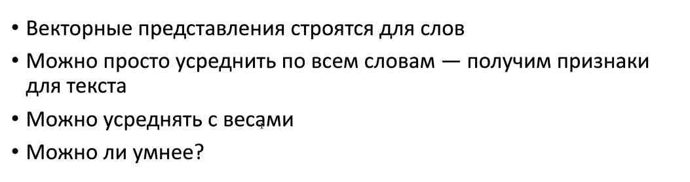

CNN для последовательностей

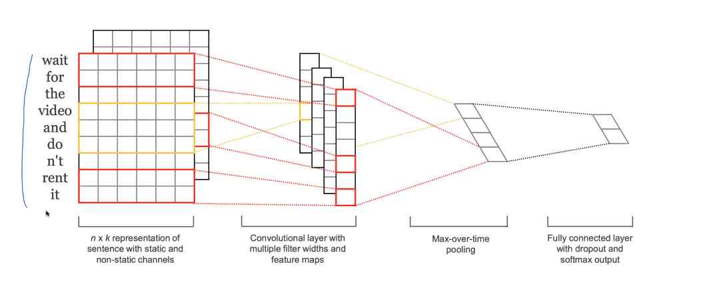

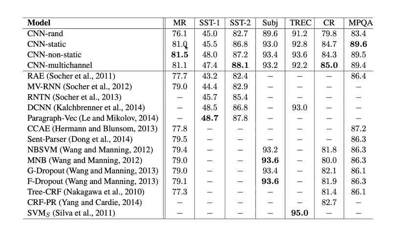

Минусы:
- Ищем выразительные "локальные" комбинации
- ...

# Рекуррентные модели

Это шаг к тому, чтобы придумать специфичную архитектуру для текстов. Сейчас рекуррентные модели не используются, но планируют перенести идеи из рек моделей для упрощения

Идея: 
- мы читаем текст последовательно
- И постепенно всё лучше понимаем, о чём он

RNN
- Последовательность x1, x2, ... (=токены)
- Читаем слева направо
- h_t - накопленная информация после чтения t элементов (вектор)

x_i - либо one-hot вектор, либо векторное представление (word2vec, fasttext)

- $h_t = f(W_{xh}*x_t + W{hh}*h_{t-1})$  - подмешиваем новые данные в старый output
- Если хотим что-то выдавать на каждом шаге: $o_t = f_o(W_{ho} * h_t)$ 
- h_t - своего рода контекст, но "глобальный"

типичный случай: $o_t \in R^N$  (o_t - LLM)
N - размер словаря
То есть предсказываем вероятность того, что здесь стоит конкретное слово
Предсказываем следующее слово

N - количество частей речи
POS tagging

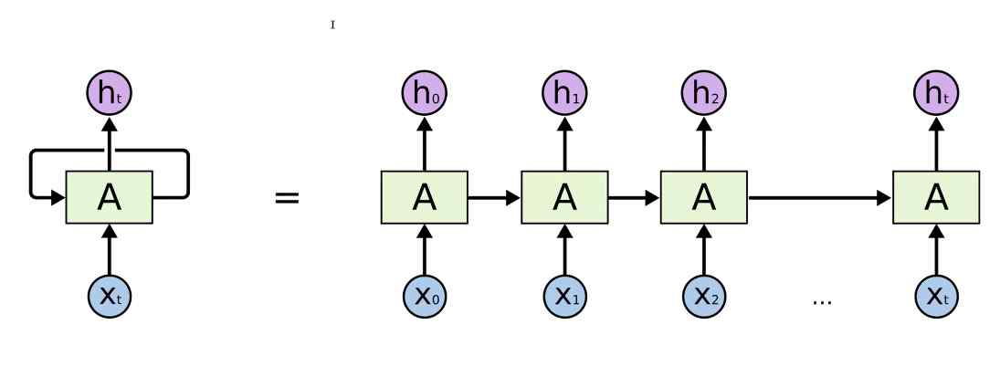

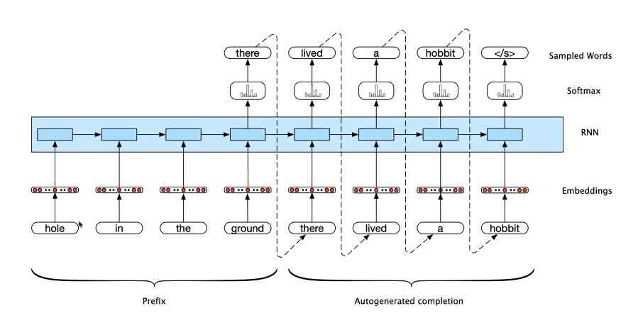

\<\/s\> - end of stream, конец генерации текста

Можно делать многослойные RNN

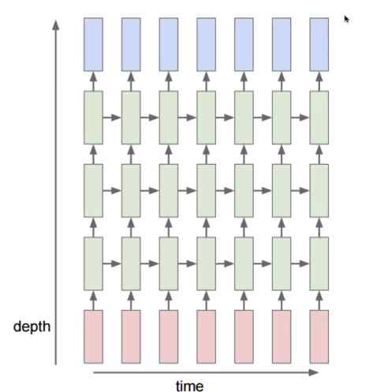

RNN на шекспире:

RNN на латехе и математике

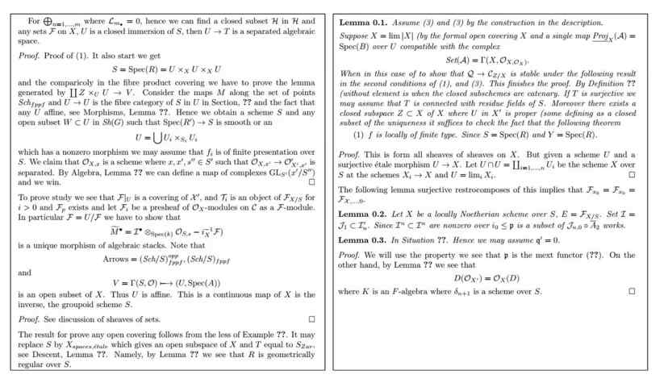

RNN на исходниках линукса (чистый C)

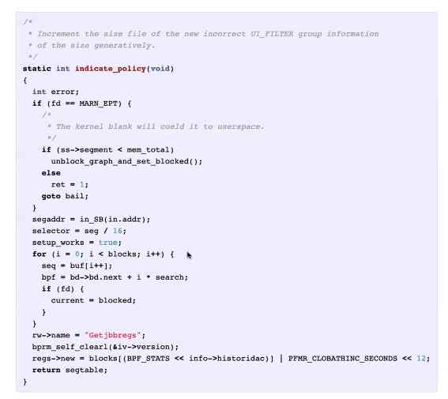

