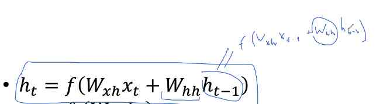
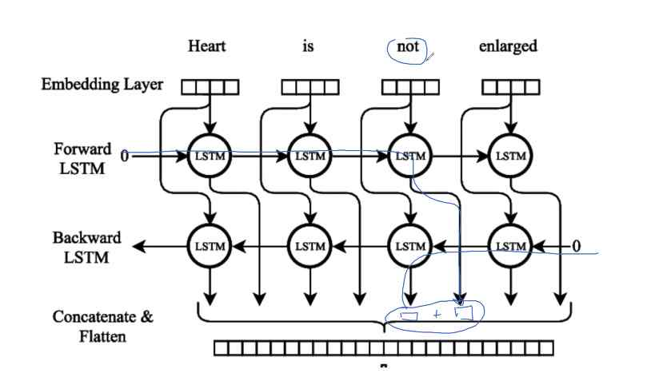
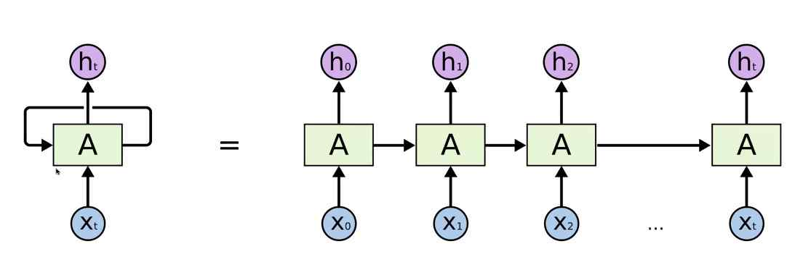
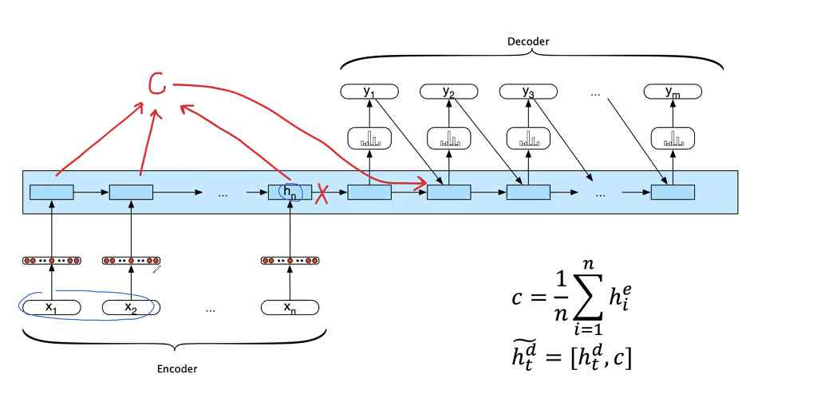
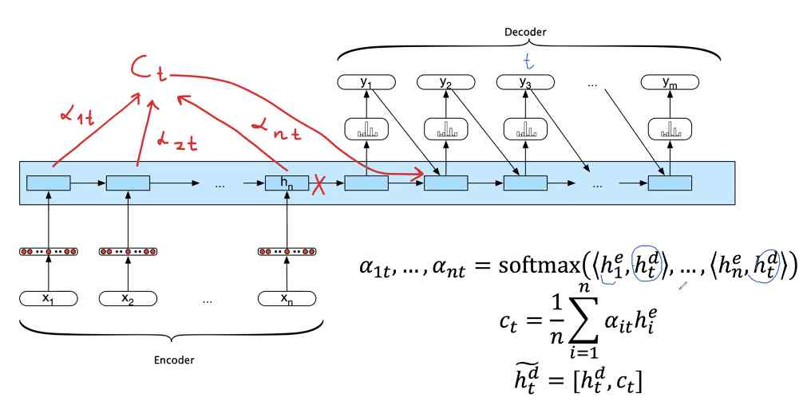
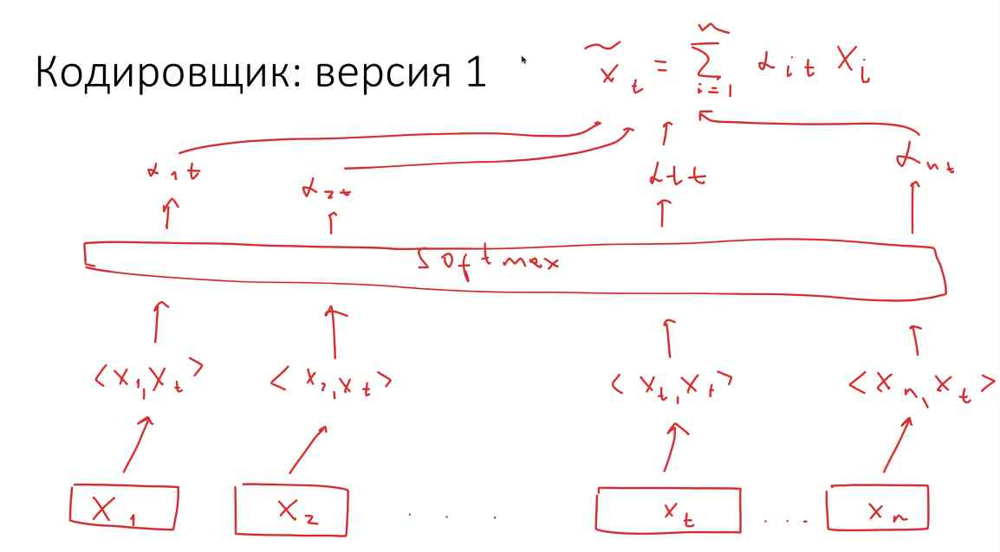

Развёртка RNN

Последовательно читаем текст и копим информацию в h

Но как обучать?

Но градиенты считать тяжело

Теперь формулы:

в первой строчке:
с помощью chain rule раскрываем дифференцирование от всех зависимых внутри переменных

из-за того, что это рекурсия, то $W_{hh}$ будет встречаться t-1 раз в формуле

Поэтому производную не так просто посчитать

поэтому формула бесконечно раскрывается следующим образом

В итоге получаем произведение t матриц

когда где-то в формуле позникает 1000-ная степень, то все значения приходят либо в 0, либо большое число (либо взрываться, либо затухать)

То есть не пойдет для длинных текстов

Первое решение

LSTM

Аналог res_net из-за обходного пути (C_t не проходит умножение), модель может протаскивать некоторую информацию

GRU

Мы выполняем все последовательно, хотя в жизни мы смотрим на предложение целиком

Bidirectional LSTM

Будем смотреть и на следующее и на предыдущее слово

Двунаправленный lstm мы не можем использовать для генерации текста!

### Seq2seq

- Машинный перевод
- Суммаризация текста
- Генерация комментариев к коду
- Математическое преобразования
- Смена стиля текста

Что делать, когда длины входного и выходного текстов разные?

Придумали архитектуру Encoder Decoder

После h_n получаем скрытый вектор (вектор контекста)

Потом декодер на каждом шаге генерирует каждое слово

##### Beam search

Порой, когда мы пишем тексты, иногда возвращаемся в назад и редактируем что-то

Давайте будем поддерживать в текущий момент 4 последовательности: запоминаем 4 варианта первого слова, 4 самых вероятных (из 16) второго слова и так далее

EOS - End of sequence

Seq2seq Machine Translation
- четырёхслойные LSTM в качестве кодировщика и декодировщика
- В каждом слове - скрытые векторы размерности 1000
- Каждое слово описывается векторным представлением размерности 1000
- Входной текст подаётся "наоборот" - тогда первое слово входного текста оказывается ближе к первому слову выходного в нашей архитектуре

Проблемы seq2seq архитектуры

Нужно сжать весь текст в один вектор
Теряется информация о первых словах

Механизм внимания

Версия 1:

При генерации всех выходов мы используем ...

Не работает

Версия 2

Представим, что я генерирую токен номер t

$\alpha_{it}$ - обучаемый параметр

Но мы прибили конеретный входной на конкретный выходной вектор. Размер тот же

Слишком много параметром (t^2), влияния от данных не зависят

Механизм внимания, версия 3

проблема: нет нормировки. C_t может получаться жирным. Давайте присобачим сюда софтмакс.

Версия 4

Это и есть итоговый механизм внимания, который хорошо работает

Кодировщик
- Начнём с качественного прочтения входного текста
- Попробуем обогатить каждое входное слово информацией обо всем тексте
- Назовём это "вниманием на себя"

Проблема: мы находили "похожие" слова и подмешали их в вектор.

# Трансформер: 
