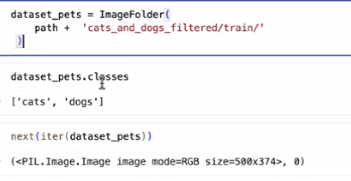
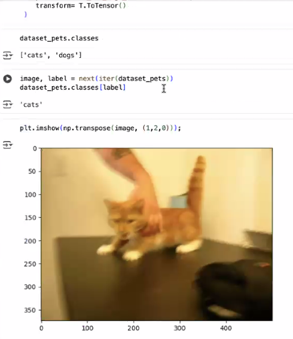
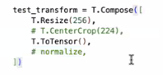
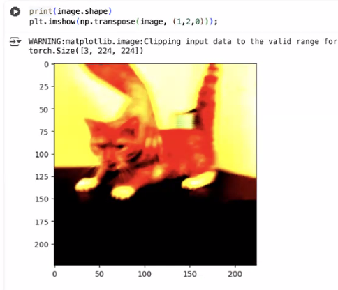

\%\%bash - писать команды в ipynb файле

torchvision - приблуды для картинок

torch.nn - слои

ImageFolder - создаем датасет 

`path = !pwd` -> \['/content/'\]

нам не хватает трансформера, чтобы перевести ее в числа

закомменченное - колхоз

dataloader

torch.utils.data.random_split(dataset_pets, \[int(0.8 * len(dataset_pets)), len-0.8*... \]) - split

augmentation
