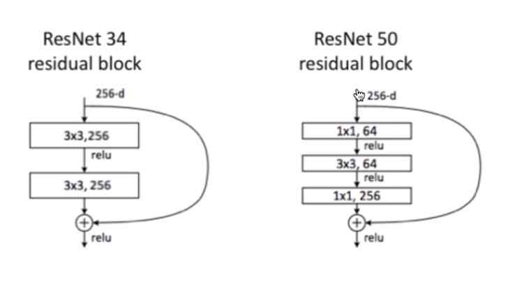

внутри torchvision.models лежит много полезного

там есть уже предсобранные архитектуры

transfer learning - использование весов из предобученных моделей. То есть когда кто-то другой обучил модель и мы взяли готовые веса за основу и дообучаем их

идея похожа на град бустинг

веса нейронки не заполняют нулями

