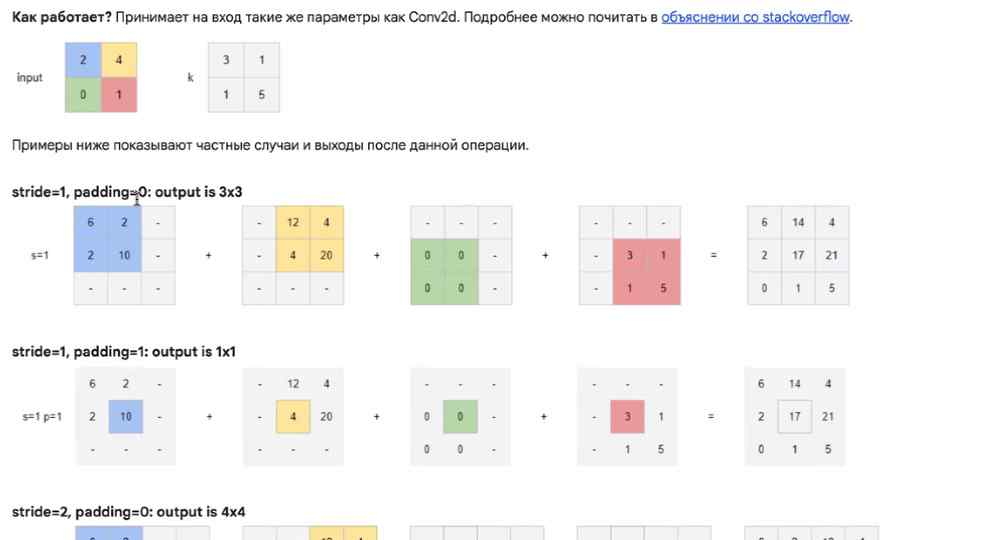

Детекция - обвод в прямоугольник
Сегментация - выделение пикселей (маска)

сегментация - попиксельная классификация

транспонированная свёртка - слой, который "разматывает" конечный вектор обратно в картинку

upscaling

внутрь архитектуры запихивать обучение - плохо
(train_step и val_step внутри архитектуры)

детекция - более сложное
Датасет устроен на порядок сложнее

