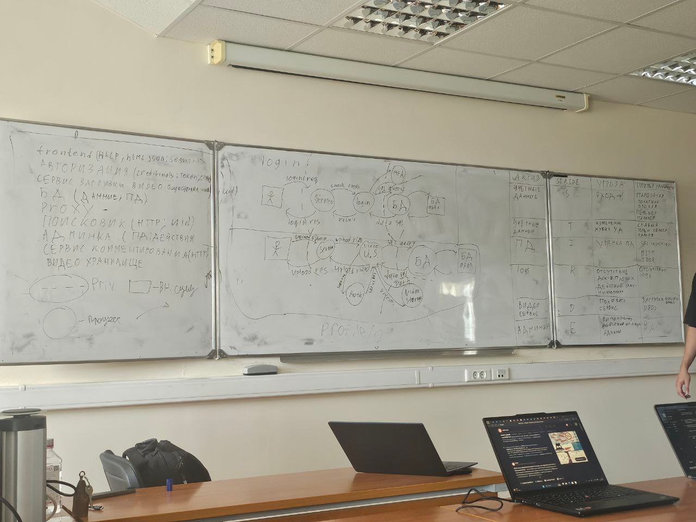

stride
spoofing
tampering - sql injection
Repudiation - отказ от авторства
Information disclosure - раскрытие секретной информации
Denial of service - отказ в обслуживании (выход сервера из строя)
Elevation of privilege - повышение привилегий

модули веб структуры в примере:
- авторизационный сервис | лежит критичное : credentials, tokens, status
- frontend : http, html, сессии, jwt, куки
- db : данные пользователей, пд (персональные данные)
- прокси сервер
- сервис загрузки видео : файлы, status, uid
- поисковик (сервис поиска) : http запросы, ссылки на видео
- административный сервис : критичные действия, пк
- сервис комментирования : http, комментарии
- видеохранилище : 

![[Materials/Pasted image 20250913133735.png]]

![[Materials/Pasted image 20250913134702.png]]

актив | stride | угроза | 
учетные данные | spoofing | вход 1 | 

