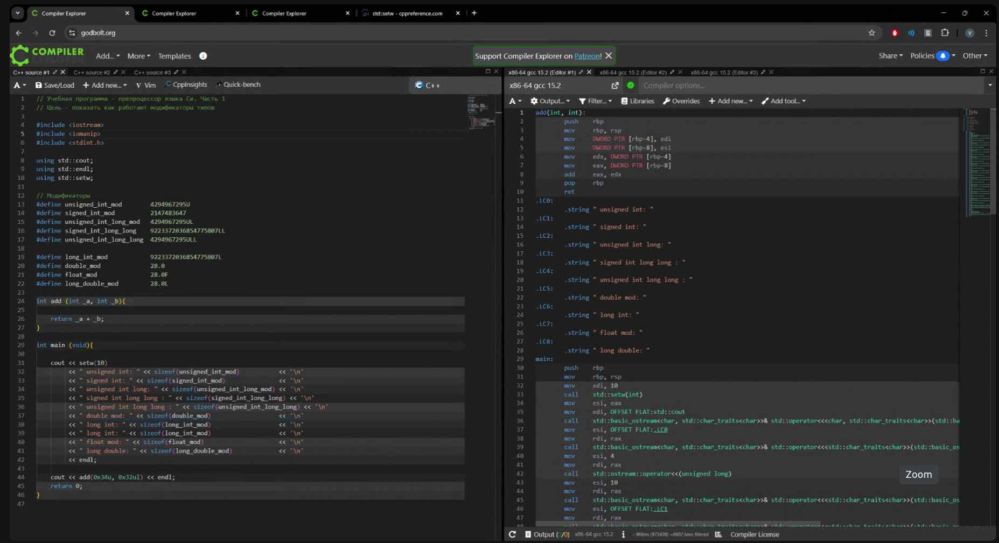

типы данных в ASM

BYTE
WORD = 2BYTE
DWORD = 4BYTE
QWORD = 8BYTE

mov загружает из второго аргумента в первый

\[\] - адрес

PRT -  указатель (\*)

DWORD - PTR \[rbp-4\] - взять данные из rbp-4, представить как адрес и взять DWORD c этого адреса

стек - регистр rsp
rbp - позволяет делить стек

and - посчитает a1 and a2 и запишет в первый аргумент 

test - побитовое И и устанавлиает регистры флагов

регистры флагов - один регистр из нескольких битов

je, jge, jmp...
call

leave - отменяет все операции со стеком, которые мы проводили

10 - код переноса строки

поч в конце mov eax 0?

edi esi **eax** - аргументы со стека

соглашение о вызове, calling convection

