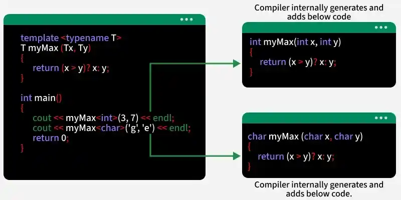

### Базовые контейнеры STL +

### Как утроен вектор и как работает push_back +

### map vs unordered map +

### reserve vs resize +

### Конкатенация строк и sting bulder +

Конкатенация: +, +=, или .append для std::string

string builder (std::stringstream or std::ostringstream):

```cpp
#include <iostream>  
#include <sstream>  
#include <string>  
using namespace std;  
  
int main() {  
   ostringstream str1;  
   string name = "Hazal";  
   int age = 12;  
   str1 << "The name is: " << name << endl;  // Using of string building
   str1 << "The age is: " << age << endl;  // Using of string building
   cout << str1.str() << endl;  // .str method to get string from a builder
   str1.str(""); // clear
   return 0;  
}
```

### Безопасная работа с подстроками без копирования - string_view +

```cpp
#include <iostream>  
#include <string_view> // C++17  
  
int c = 1;  
  
// str provides read-only access to whatever argument is passed in  
void printSV(std::string_view str) // now a std::string_view  
{  
    std::cout << "std::string_view sv" << c << ": " << str << " " << (void*)str.data() << ' ' << &str << '\n';  
    c++;  
}  
  
int main() {  
    char a[] = {"abc"};  
    std::cout << "char a[]: " << a << " " << &a << '\n';  
  
    std::string s{a}; // string makes new copy of a c-style string (with new pointer)  
    std::cout << "std::string: " << s << " " << (void*) s.data() << " " << &s << '\n';  
  
    std::string_view sv1(s); // now a std::string_view  
    printSV(sv1); // it makes new sv on std::string, ptr points to a data in std::sting (not a char[] in beginning)  
  
    std::string_view sv2(s); // sv on s already exists => &sv2 == &sv1  
    printSV(sv2);  
  
    std::string_view sv3(a);  
    printSV(sv3);  
      
    return 0;  
}
```

output:
```
char a[]: abc 0x9ff9cb
std::string: abc 0x9ff9b8 0x9ff9b0
std::string_view sv1: abc 0x9ff9b8 0x9ff980
std::string_view sv2: abc 0x9ff9b8 0x9ff980
std::string_view sv3: abc 0x9ff9cb 0x9ff980
```

### Доступ к несуществующему индексу +

Надо знать, как переменные располагаются в памяти, чтобы правильно играться с этим

```cpp
int a[10];  
std::cout << a[4] << '\n'; // random  
std::cout << a[8] << '\n'; // random  
std::cout << a[10] << '\n'; // random  
std::cout << a[11] << '\n'; // random  
  
for (int i = 0; i < 10; a[i] = 0,++i);  
std::cout << a[4] << '\n'; // 0  
std::cout << a[8] << '\n'; // 0  
std::cout << a[10] << '\n'; // 10 (= last value in i), bcs in cycle i created after a => in memory address for i would be right after all array "a"  
std::cout << a[11] << '\n'; // random  
  
return 0;
```

Но как только мы добавляем другую переменную (b), то тут уже другое поведение

```cpp
int main() {  
    int a[10];  
    std::cout << a[4] << '\n'; // random  
    std::cout << a[8] << '\n'; // random  
    std::cout << a[10] << '\n'; // random  
    std::cout << a[11] << '\n'; // random  
  
    for (int i = 0; i < 10; a[i] = 0,++i);  
    int b = 1337;  
    std::cout << a[4] << '\n'; // 0  
    std::cout << a[8] << '\n'; // 0  
    std::cout << a[10] << '\n'; // 1337  
    std::cout << a[11] << '\n'; // 10  
  
    return 0;  
}
```
Это происходит, потому что компилятор решил подвинуть i дальше по памяти (при компиляции, т.к. он сразу весь код видит), либо потому что обычные переменные располагаются в стеке в другом порядке

### Шаблоны - основы generic-программирования +

```cpp
template <typename T> 
T myMax(T x, T y) {
    return (x > y) ? x : y;
}

int main() {
    // Using myMax
    cout << "Max of 3 and 7 is: " << myMax<int>(3, 7) << endl;
    cout << "Max of 3.5 and 7.5 is :" << myMax<double>(3.5, 7.5) << endl;
    cout << "Max of 'g' and 'e' is: " << myMax<char>('g', 'e') << endl;
    return 0;
}
```
output:
```
Max of 3 and 7 is: 7
Max of 3.5 and 7.5 is :7.5
Max of 'g' and 'e' is: g
```



Можно делать сразу несколько тайпнеймов (типов данных):
```cpp
template <typename A, typename B, ...>
```

Также можно миксовать с классами:

```cpp
template <typename T1, typename T2, typename T3> 
class Geek {
public:
    T1 x;
    T2 y;
    T3 z;

    Geek(T1 val1, T2 val2, T3 val3) : x(val1), y(val2), z(val3){}

    void getValues() {
        cout << x << " " << y << " " << z;
    }
};

int main() {
    // Creating objects of Geek with different data types
    Geek<int, double, string> intDoubleStringGeek(10, 3.14, "Hello");
    Geek<char, float, bool> charFloatBoolGeek('A', 5.67f, true);

    intDoubleStringGeek.getValues();
    cout << endl;
    charFloatBoolGeek.getValues();

    return 0;
}
```


Также есть поддержка constexpr с 14 версии
```cpp
template <typename T> constexpr T pi = T(3.14159);

int main() {
    // Using pi with different types
    cout << "Pi as float: " << pi<float> << endl;
    cout << "Pi as double: " << pi<double>;
    return 0;
}
```

Можно указывать тайпнеймы по умолчанию, классами или вообще использовать non-type шаблоны
```cpp
template <class T1, int value, T3 = double>
```

Можно делать что-то на подобие функций (метапрограммирование):

```cpp
#include <iostream>
using namespace std;

// Template metaprogramming for calculationg factorial at compile-time
template <int N> 
struct Factorial {
    static const int value = N * Factorial<N - 1>::value;
};

// Specialization for the base class (Factorial<0>)
template <> struct Factorial<0> {
    static const int value = 1;
};

int main()
{
    
    // Factorial computation happens at compile-time
    cout << "Factorial of 5 is: " << Factorial<5>::value;
    
    return 0;
}
```